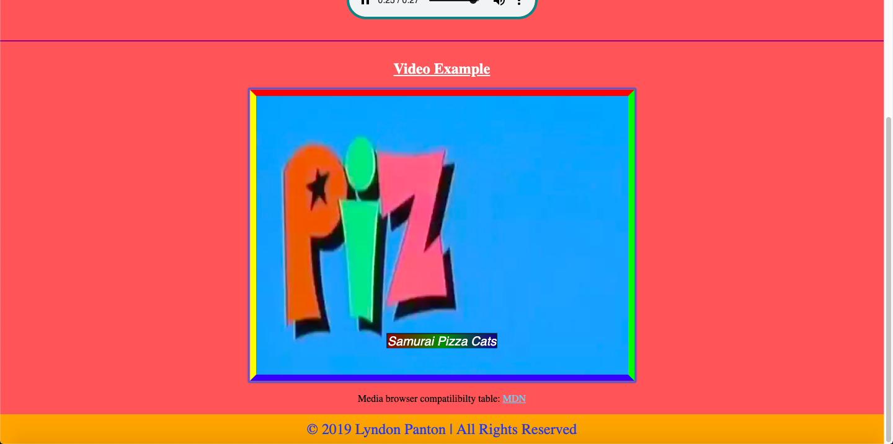

# Multimedia

## How To Open
1. Go to the folder the project was downloaded in your operating system's terminal
2. Start a local server in that folder

## How To Use
- Click the navigation links to naviagate to their repective sections
- The audio section contains a piece of audio that is should autoplay, has controls and is initially muted
- The video section contains a video that should autoplay, has controls and is initially muted
- The video also has caption options for English, Spanish and French

## Requirements
- The project requires a browser to run
- The browser must have Javascript available and enabled

## Preview

## Extra Information
1. This was done as part of the w3c and Microsoft's
HTML & CSS Fundamentals course
2. The English captions were custom made and the Spanish and French captions were translated from the English captions using Google Translate and thus may not be completely cohorent